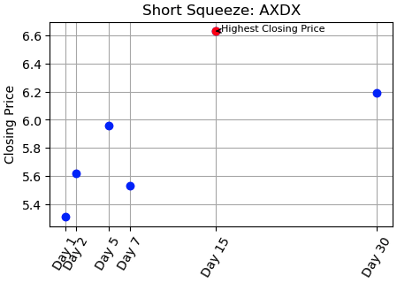
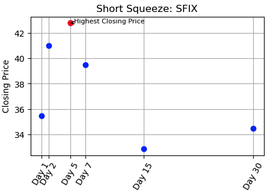

# Pedro Short Squeeze Predictor

## Table of Contents

- [Project Overview](#project-overview)
- [Project Structure](#project-structure)
- [Concepts Review](#concepts-review)
- [Example](#example)
- [Installation and Usage](#installation-and-usage)
- [Data Prepation](#data-preparation)
- [Machine Learning Models](#machine-learning-models)
- [Results and Summary](#results-and-summary)
- [Analysis](#analysis)
- [Future Work](#future-work)
- [Contributing](#contributing)
- [License](#license)
- [Conclusion](#conclusion)

## Project Overview

Pedro is a machine learning project focused on predicting short squeezes in the stock market. By analyzing historical data on short float percentages and insider trading activity, Pedro aims to identify stocks with a high potential for rapid price increases. Leveraging various machine learning models, Pedro provides investors with insights to make informed trading decisions and take advantage of short squeeze opportunities in the market.

## Project Structure

1. **Data collection and preprocessing**: We gather historical stock data and insider trading information, clean the data, and preprocess it for machine learning.

2. **Model training and evaluation**: We use various machine learning models, including Decision Trees, Random Forests, Gradient Boosting, XGBoost, and Neural Networks. We then evaluate the models using accuracy, precision, and recall metrics.

3. **Integration with Alpaca API**: We integrate the trained models with the Alpaca API to perform simulated trading based on the predicted short squeeze opportunities.

## Concepts Review

### Short Squeeze

- A short squeeze is a market phenomenon that occurs when a heavily shorted stock experiences a rapid increase in price. Short selling is a trading strategy where investors borrow shares of a stock and sell them, expecting the price to decline. They plan to buy back the shares at a lower price to return them to the lender and profit from the price difference.

- However, if the stock price starts to rise instead of falling, short sellers may panic and rush to buy back the shares to limit their losses. This increased demand for the stock can lead to a surge in its price, forcing more short sellers to cover their positions by buying shares. The buying pressure created by short sellers can amplify the upward movement of the stock, causing a short squeeze.

### Short Float 

- Short float, also known as short interest ratio, refers to the percentage of a company's outstanding shares that are held short by investors. It is a measure of the total number of shares sold short divided by the stock's total float (shares available for public trading). The float short ratio indicates the level of bearish sentiment in the market towards a particular stock. A higher float short ratio suggests a larger number of investors are betting against the stock, anticipating a price decline. This can potentially lead to a short squeeze if positive news or a significant price increase triggers a rush among short sellers to cover their positions, driving the stock's price higher.

### Insider Trading

- Insider trading refers to the buying or selling of stocks by individuals with access to non-public information. Insiders are legally required to disclose their trades to the regulatory authorities, such as the Securities and Exchange Commission (SEC) in the United States. The disclosed information typically includes the date of the trade, the number of shares bought or sold, and the price at which the transaction took place.

- Analyzing insider trading activity provides insights into the sentiment and confidence of insiders, large-scale insider buying may indicate that insiders believe the stock is undervalued and have positive expectations for its future performance.

## Example

#### AXDX Short Squeeze and Close-Up: 



#### GRPN Short Squeeze and Close-Up: 


#### SFIX Short Squeeze and Close-Up: 


 
## Installation and Usage

1. Install the required libraries:

```bash
pip install numpy pandas yfinance tensorflow pandas_market_calendars scikit-learn imbalanced-learn
```

2. Clone the repository:

```bash
git clone https://github.com/regulolanz/Pedro-Short-Squeeze-Predictor
```

3. Run the project:

```css
python Pedro.py
```

4. Load the environment variables 

```python
load_dotenv(dotenv_path="Alpaca.env")
```

5. Create the Alpaca API:

```python
api = create_alpaca_api()
```

6. Load the trained models:

```python
models = load_models(model_names)
```

## Data Preparation

### Data Collection: 

Pedro gathers historical stock data, including short float percentages and insider trading data:

Short Data:

https://shortsqueeze.com/2023.php

Insider Trading:

https://www.insidermonkey.com/insider-trading/purchases/


Filters:
- Short Float = >10%
- Market Cap = >300M
- Insider Trading = >500K

### Data Processing:

- The stock market data, float short, and insider trading data are combined based on the common stock ticker symbol or company identifier. Data cleaning and features engineering techniques are applied. This include handling missing values, normalizing or scaling features, encoding categorical variables, splitting the dataset into features and target variables. The features will include the selected columns from the previous step, while the target variable will be the 'Short Squeeze' column.

- To identify a Short Squeeze based on return values in a DataFrame:
    - Calculate the difference in days between the Short Float and Insider Trading event, storing it in a new column.
    - Filter out difference that is greater than 30 days.
    - Drop duplicates, keeping only the first occurance.
    - Retrieve closing price since the selected date up to 30 days.
    - A new column named 'Short Squeeze' is added to the DataFrame and initialized with 0.
    - If the return is >= 10% for either 5 or 7 days, or >= 15% for 15 days, or >= 20% for 30 days, the 'Short Squeeze' column is set to 1 for those rows.
    - All other rows where the conditions are not met have their 'Short Squeeze' value set to 0.

## Machine Learning Models: 

Pedro utilizes multiple machine learning models for predicting short squeezes. The selected models include GradientBoostingClassifier, SVC (Support Vector Classifier), RandomForestClassifier, DecisionTreeClassifier, and XGBClassifier.

#### GradientBoostingClassifier

The GradientBoostingClassifier is a machine learning model that builds an ensemble of weak prediction models, typically decision trees, to create a strong predictive model. It combines the predictions of multiple weak models to produce a final prediction.

#### SVC (Support Vector Classifier)

The SVC model is a supervised machine learning algorithm that separates data points into different classes using hyperplanes. It aims to find the best possible decision boundary that maximally separates the classes. 

#### RandomForestClassifier

The RandomForestClassifier is an ensemble learning model that combines multiple decision trees to make predictions. Each tree is trained on a subset of the data, and the final prediction is determined by a voting mechanism.

#### DecisionTreeClassifier

The DecisionTreeClassifier is a machine learning model that builds a decision tree based on the features of the data. It splits the data based on certain conditions at each node and makes predictions based on the majority class at the leaf nodes. 

#### XGBClassifier

The XGBClassifier is an implementation of the gradient boosting algorithm using decision trees as base learners. It is known for its efficiency and performance in handling complex datasets. 

## Results and Summary

- GradientBoostingClassifier:
    - Accuracy: 0.65
    - Precision: 0.43
    - Recall: 0.64
    - F1-Score: 0.51
***
- SVC (Support Vector Classifier):
    - Accuracy: 0.61
    - Precision: 0.35
    - Recall: 0.43
    - F1-Score: 0.39
***
- RandomForestClassifier:
    - Accuracy: 0.67
    - Precision: 0.45
    - Recall: 0.71
    - F1-Score: 0.56
***
- DecisionTreeClassifier:
    - Accuracy: 0.65
    - Precision: 0.43
    - Recall: 0.71
    - F1-Score: 0.54
***
- XGBClassifier:
    - Accuracy: 0.71
    - Precision: 0.50
    - Recall: 0.71
    - F1-Score: 0.59
***
- Neural Network:
    - Accuracy: 0.49
    - Precision: 0.41
    - Recall: 0.79
    - F1-Score: 0.54

## Analysis


- Accuracy: 

Accuracy represents the overall correctness of the classifier's predictions. Among the classifiers mentioned, the XGBClassifier achieves the highest accuracy of 0.71, indicating that it correctly classifies approximately 71% of the instances in the dataset. The RandomForestClassifier and GradientBoostingClassifier follow with accuracies of 0.67 and 0.65, respectively. The other classifiers, including the SVC, DecisionTreeClassifier, and Neural Network, exhibit lower accuracies ranging from 0.61 to 0.65.
- Precision: 

Precision measures the accuracy of positive predictions made by the classifiers. The RandomForestClassifier and XGBClassifier show relatively higher precision compared to other classifiers. This suggests that when these classifiers predict a positive instance, they are more likely to be correct.

- Recall: 

Recall indicates the ability of the classifiers to identify positive instances correctly. The Neural Network classifier demonstrates the highest recall, followed by the DecisionTreeClassifier and XGBClassifier. These classifiers have a better ability to capture the actual positive instances in the dataset.

- F1-Score: 

The F1-score provides a balance between precision and recall. The XGBClassifier achieves the highest F1-score, indicating a good balance between correctly identifying positive instances and limiting false positives.

## Future Work

- Plan to improve the precision of the models by further tuning the hyperparameters, exploring hybrid models, and refining the feature selection.
- Integrate live data feeds, which would allow the model to make real-time predictions based on the most recent market data.
- Develop a strategy for generating sell signals to accompany the current buy signals, providing a complete trading strategy for users.

## Contributing

If you wish to contribute to this project, please fork the repository and submit a pull request.

## License

This project is licensed under the MIT License - see the [LICENSE](LICENSE) file for details.

## Conclusion

Pedro is a machine learning project that aims to predict short squeezes in the stock market by analyzing short float percentages and insider trading activity. By providing investors with insights and predictions, Pedro can help them make informed trading decisions and potentially take advantage of short squeeze opportunities. 